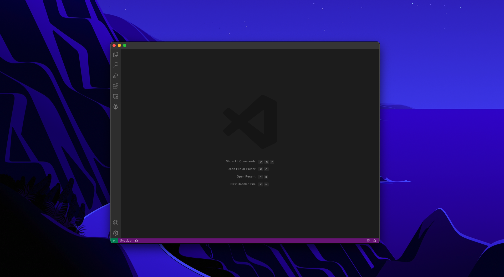
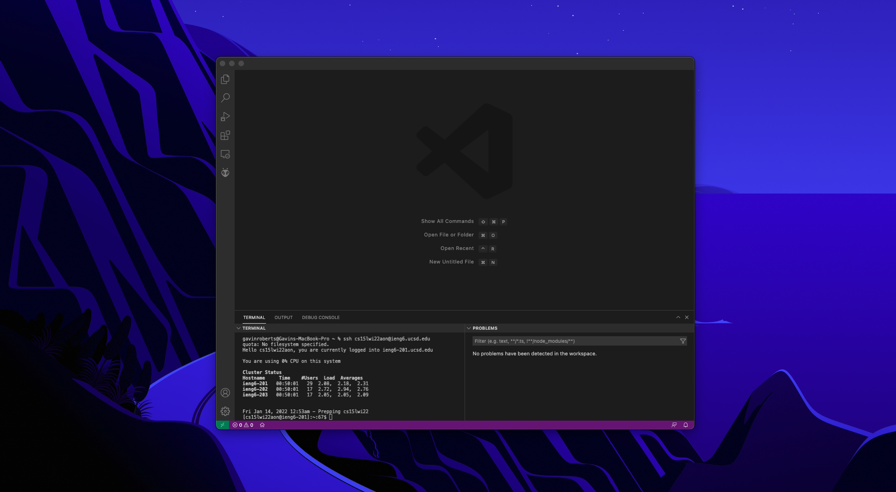
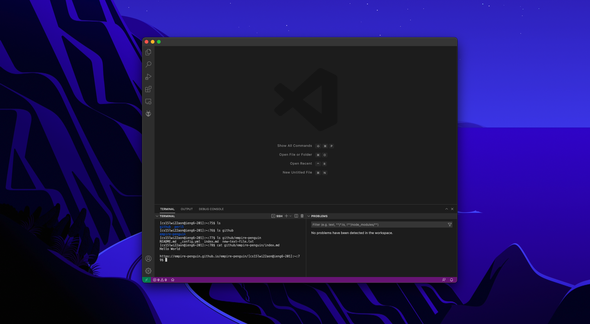

[Main Page](https://empire-penguin.github.io/empire-penguin/)

***

Lab Report 1
============

Remote Access and the File System.
------------------------------------

***

Part 1 Installing VSCode
------------------------

To begin our coding journey we must first install an IDE also known as an Integrated Developer Environment. For this class we have choosen to use VSCode since it is supported on all major platforms and offers a wide range of extensions which can allow the user to do much more than just write code!

Get [VSCode](https://code.visualstudio.com/) installed by following along with the directions they provide on their website. After everything is finished installing upon opening VSCode for the first time you should see something similar to the following:

Part 2 Remotely Connecting
--------------------------

Now that we have a working environment to write our code lets now tackle the issue of computing power. While my Macbook Pro is great for editing code, video, and even playing some games, it will be laughed out of a room if it ever had to train a neural network on large sets of data. That seems like too much of an interesting problem to just give up on to. The solution is to connect to the super computers which reside on UCSD's compass using an ssh command. 

Once you obtain your course-specific account ID for accessing the super computers found [here.](https://sdacs.ucsd.edu/~icc/index.php) open a terminal in VSCode by using the keyboard shortcut ``^ + ` `` that is ``ctrl + ` `` and use the command `ssh cs15lwi22NAME@ieng6.ucsd.edu` where `NAME` is replaced by the ID found on the UCSD website.

If prompted with an ssh authenticity warning type `yes` and press enter to continue with the ssh command. Once you successfully log into the schools remote server it should something like this:

Part 3 Trying Some Commands
------------------------------

Now that we can log into the school computers remotely let us now try sending some commands to the remote computer to execute. 

Some commands we can try to use are
* `cd ~`
* `cd`
* `ls -lat`
* `ls -a`
* `ls <directory>` where `<directory>` is `/home/linux/ieng6/cs15lwi22/cs15lwi22NAME`, where `NAME` is the ID found earlier. 
* `cp /home/linux/ieng6/cs15lwi22/public/hello.txt ~/`
* `cat /home/linux/ieng6/cs15lwi22/public/hello.txt` 
* `exit`

Here are some screenshots running different commands

Part 4 Moving Files with `scp`
---------------------------------

Part 5 Setting an SSH Key
----------------------------

Part 6 Optimizing Remote Running
-----------------------------------