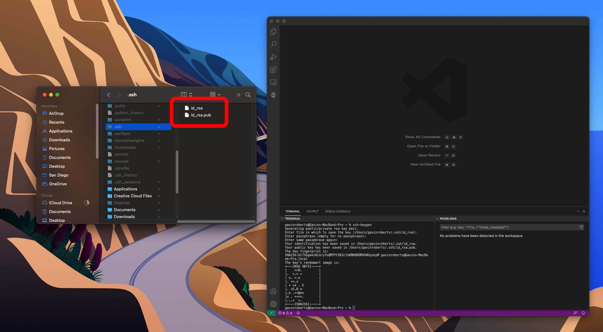
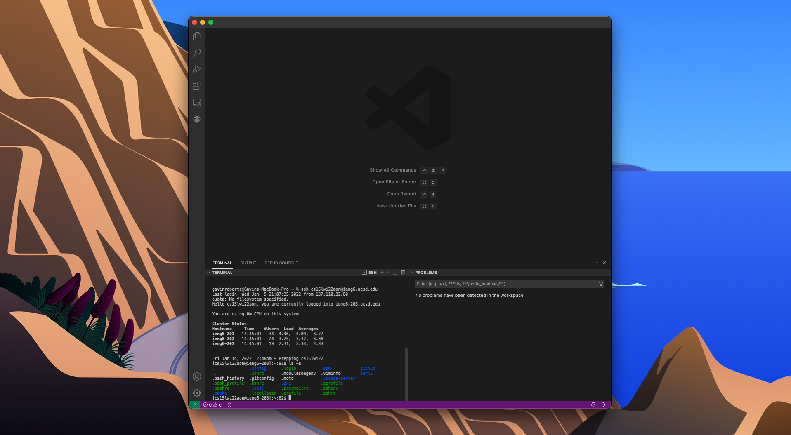

[Main Page](https://empire-penguin.github.io/empire-penguin/)

***

Lab Report 1
============

Remote Access and the File System.
------------------------------------

Part 1 Installing VSCode
------------------------

To begin our coding journey we must first install an IDE also known as an Integrated Developer Environment. For this class we have choosen to use VSCode since it is supported on all major platforms and offers a wide range of extensions which can allow the user to do much more than just write code!

Get [VSCode](https://code.visualstudio.com/) installed by following along with the directions they provide on their website. After everything is finished installing upon opening VSCode for the first time you should see something similar to the following:


Part 2 Remotely Connecting
--------------------------

Now that we have a working environment to write our code lets now tackle the issue of computing power. While my Macbook Pro is great for editing code, video, and even playing some games, it will be laughed out of a room if it ever had to train a neural network on large sets of data. That seems like too much of an interesting problem to just give up on to. The solution is to connect to the super computers which reside on UCSD's compass using an ssh command. 

Once you obtain your course-specific account ID for accessing the super computers found [here.](https://sdacs.ucsd.edu/~icc/index.php) open a terminal in VSCode by using the keyboard shortcut ``^ + ` `` that is ``ctrl + ` `` and use the command `ssh cs15lwi22NAME@ieng6.ucsd.edu` where `NAME` is replaced by the ID found on the UCSD website.

If prompted with an ssh authenticity warning type `yes` and press enter to continue with the ssh command. Once you successfully log into the schools remote server it should something like this:


Part 3 Trying Some Commands
------------------------------

Now that we can log into the school computers remotely let us now try sending some commands to the remote computer to execute. 

Some commands we can try to use are
* `cd ~`
* `cd`
* `ls -lat`
* `ls -a`
* `ls <directory>` where `<directory>` is `/home/linux/ieng6/cs15lwi22/cs15lwi22NAME`, where `NAME` is the ID found earlier. 
* `cp /home/linux/ieng6/cs15lwi22/public/hello.txt ~/`
* `cat /home/linux/ieng6/cs15lwi22/public/hello.txt` 
* To close down the connection use `exit`

Here are some screenshots running different commands


Part 4 Moving Files with `scp`
---------------------------------

Now that we have verified that we can run some simple commands we should now try something a bit more complicated. The command `scp` can be used to copy files from a local computer, such as the one you are reading this from, to a remote server. 

To test this command we will use the following test file called: `WhereAmI.java` containing the following: 
```
    // WhereAmI.java
    
    Class WhereAmI {
        public static void main(Strings[] args){
            System.out.println(System.getProperty("os.name"));
            System.out.println(System.getProperty("user.name"));
            System.out.println(System.getProperty("user.home"));
            System.out.println(System.getProperty("user.dir"));
        }
    }
```

Then run the following command: `scp WhereAmI.java cs15lwiNAME@ucsd.edu:~/` where `NAME` is the ID found earlier. 

You will be greated with a response similar to what happened with the `ssh` command. Enter your password and watch as your file flies across the internet to the remote server. To verify your file reached its destination safely `ssh` back into UCSD's servers with the `ssh` command from **Part 2**.

Once connected, try to compile and run the file you sent from your computer using the normal java commands `java` and `javac`. 

Part 5 Setting an SSH Key
----------------------------

Remote connecting is useful to programmers, however it can be rather annoying having to enter a password every time you want to run a command or copy a file to a remote host. To get around this we can use ssh keys. 

To generate a new public-private ssh key pair use the command: `ssh-keygen` which, upon entering the default options will create two files in your `~/.ssh` directory called `id_rsa` and `id_rsa.pub`, the private and public keys respectively.

It should look like the following:


We need to now make a .ssh directory to put the newly generated public ssh key on the UCSD remote server. `ssh` to the server as previously described and make the directory using the command: `mkdir .ssh`. Log out of the remote host.

Now copy the public key `id_rsa.pub` to the remote .ssh directory using the following command: 

`scp /Users/NAME/.ssh/id_rsa.pub cs15lwi22NAME@ieng6.ucsd.edu:~/.ssh/authorized_keys`

After this is done you can `ssh` and `scp` without using a password! Here is what it looks like when it is working:



Part 6 Optimizing Remote Running
-----------------------------------