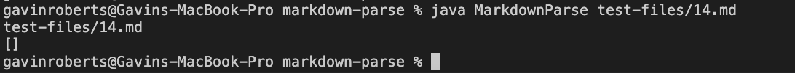
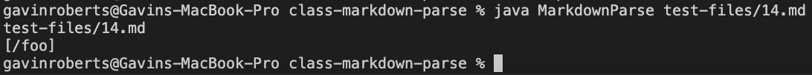
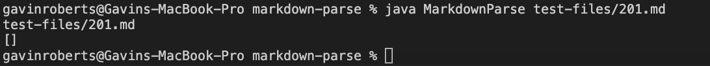
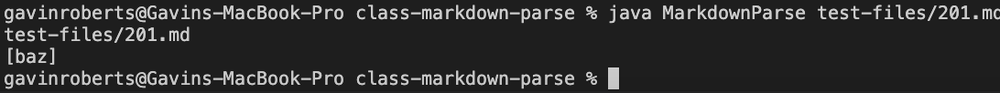

[Main Page](https://empire-penguin.github.io/empire-penguin/)

***

Lab Report 5
============

Putting it All Together
-----------------------
In the previous labs we used a provided markdown parser to run unit tests and verified correct functionality between 
our implimentation and the one provided. 

To verify correct functionality we had to input about 650 different markdown files and recorded the returned links in 
a text file. This was done for both implimentations by using the command `sh script.sh > results.txt`. 
Once we had the results stored in the different text files, I used the command `diff` to output the differences. 
The exact command used was `diff results.txt other-results.txt > differences.txt`. 

Here is a snippet of some of what is contained in `differences.txt`
```
92c92
< []
---
> [/foo]
212c212
< []
---
> [url]
230c230
< []
---
> [baz]
542c542
< []
---
> [/foo`]
...
```

First Bug
---------

As seen in the first few lines of the `differences.txt` file there is a discrepancy 
between the provided markdown parser and my teams implimentation. According to `diff` 
my parser ignored the link `\foo` however the provided parser registered it as a 
correct link. Lets open the file as see which is right. 
The file in question is `14.md` which contains:
```
\*not emphasized*
\<br/> not a tag
\[not a link](/foo)
\`not code`
1\. not a list
\* not a list
\# not a heading
\[foo]: /url "not a reference"
\&ouml; not a character entity
```

Here is my parser output with that file:


Here is provided parser output with that file:



The correct implimentation should display `[]` as our teams did. The line containing `\foo` should not be registered as a link because it is prefaced with a `\`. This means our parser had the correct implimentation and the provided one
was incorrect.

This bug is a result of not checking if there is a character before the first opening 
bracket which would result in wrongly identifying a link. And can be fixed by doing this
check first.

Second Bug
----------

As seen in the `differences.txt` file at line 230 the provided 
implimentation is detecting `baz` as a link while our implimentation does not detect anything in this file. The file in question is `201.md` which contains:
```
[foo]: <bar>(baz)

[foo]
```

Here is my parser output with that file:


Here is provided parser output with that file:


The correct implimentation should display `[]` as our teams did. The provided parser is not checking for whitespace between the closing bracket and the opening parathesis. This done in our parser and if it is implimented in the provided this will solve the second bug.
