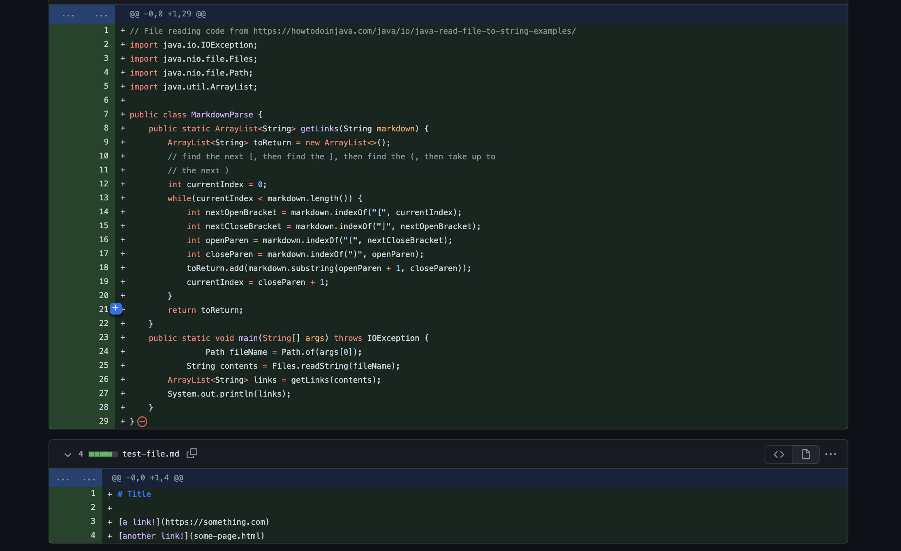
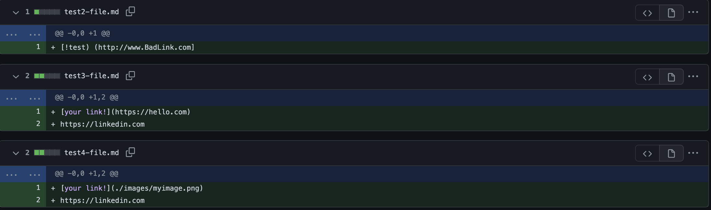
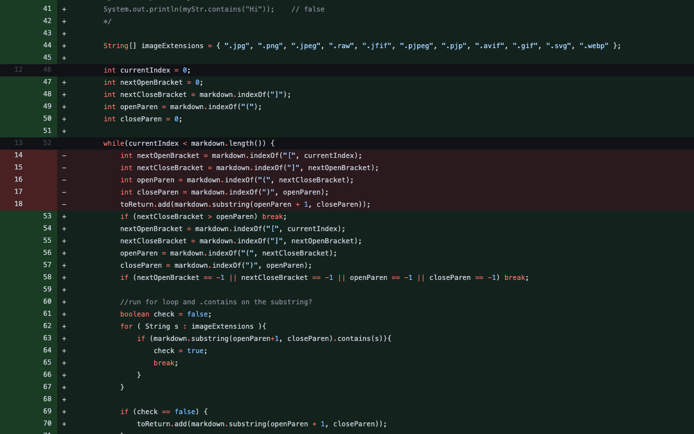
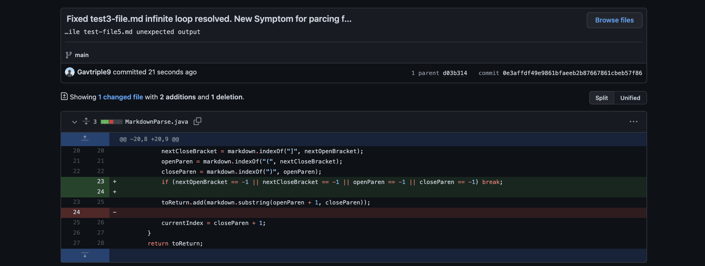
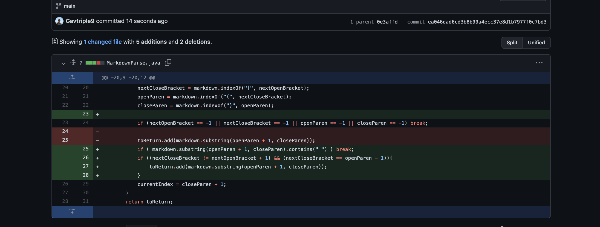

[Main Page](https://empire-penguin.github.io/empire-penguin/)

***

Lab Report 2
============

Incremental Programming and Debugging & When Tests Accumulate. 
------------------------------------

This lab consisted of testing various markdown files to see if our
markdown parser was capable of performing the right interpretation. 

We began by forking the repo found [here](https://github.com/ucsd-cse15l-w22/markdown-parse) and testing to see if our 
test file is successfully parsed.

The inital fork contained the following java and text files:


And successfully created the output 
```
[https://something.com, some-page.html]
```

First Bug, Symptom and Fix
------------------------------------

We then created the following test files:



After attempting to parse [`test2-file.md`](https://github.com/empire-penguin/markdown-parse/blob/ea4c83fbd96a476233b95048aa12cb38e3113395/test2-file.md) we recieved the following symptom:
```
Exception in thread "main" java.lang.OutOfMemoryError: Java heap space
        at java.base/java.lang.StringLatin1.newString(StringLatin1.java:769)
        at java.base/java.lang.String.substring(String.java:2709)
        at MarkdownParse.getLinks(MarkdownParse.java:17)
        at MarkdownParse.main(MarkdownParse.java:25)
```

This symptom was most probabily caused by an infinite loop in light of the out of memory error and 
that the output took a substancial amount of time before throwing the error.


To resolve the bug we decided to first initialize the variables before the while loop
and then checked to see if a closing bracket came after an open parathesis break the loop and
ignore that line. Here are those changes:



The symptom of an infinite loop was caused by the bug of not having a check to determine if the 
ordering of the parathesis and brackets was correct. This is because in the `test2-file.md` the
parethesis came before the closing bracket.


Second Bug, Symptom, and Fix
------------------------------------

After solving the first problem we ran into another issue when trying to parce [`test3-file.md`](https://github.com/empire-penguin/markdown-parse/blob/main/test3-file.md) we recieved the following symptom:

```
Exception in thread "main" java.lang.OutOfMemoryError: Java heap space
        at java.base/java.util.Arrays.copyOf(Arrays.java:3512)
        at java.base/java.util.Arrays.copyOf(Arrays.java:3481)
        at java.base/java.util.ArrayList.grow(ArrayList.java:237)
        at java.base/java.util.ArrayList.grow(ArrayList.java:244)
        at java.base/java.util.ArrayList.add(ArrayList.java:454)
        at java.base/java.util.ArrayList.add(ArrayList.java:467)
        at MarkdownParse.getLinks(MarkdownParse.java:24)
        at MarkdownParse.main(MarkdownParse.java:33)
```
This symptom was most probabily caused by an infinite loop in light of the out of memory error and 
that the output took a substancial amount of time before throwing the error.

We believed this was a result of not first checking that all types of brackets exist in the .md file.

We then came up with the following solution:



The symptom was the infinite loop and out of memory exception caused by the bug that we were not checking for all types of 
brackets exisitng in the document. The file which caused this bug is an example of a file that didn't contain all types of brackets.


Third Bug, Symptom, and Fix
------------------------------------

After feeling good about solving the second bug, the third and final bug was a pain. We tried to parce [`test-file5.md`](https://github.com/empire-penguin/markdown-parse/blob/main/test-file5.md) where we recieved the following symptom:

```
java.lang.AssertionError: expected:<[]> but was:<[page.com]>
        at org.junit.Assert.fail(Assert.java:89)
        at org.junit.Assert.failNotEquals(Assert.java:835)
        at org.junit.Assert.assertEquals(Assert.java:120)
        at org.junit.Assert.assertEquals(Assert.java:146)
        at MarkdownParseTest.testGetLink5(MarkdownParseTest.java:58)
```

We got a result, namely "`[page.com]`", even though the link contained in the test-file5.md was not valid. This is the symptom of returning an 
expected value.

To resolve this we decided to make sure no whitespace was detected between the open parathesis and closed bracket. We also checked to make sure
the next closed bracket wasn't before the open one. and then checks to make sure the openParathesis was directly after the closed bracket.



The bug in this case was not checking for whitespace and correct bracket order. The symptom was the unexpected returned value from our parser. The 
test-file5.md contained whitespace between brackets which resulted in this bug being relieved.