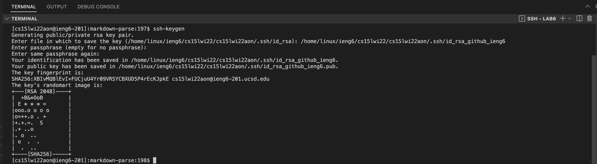
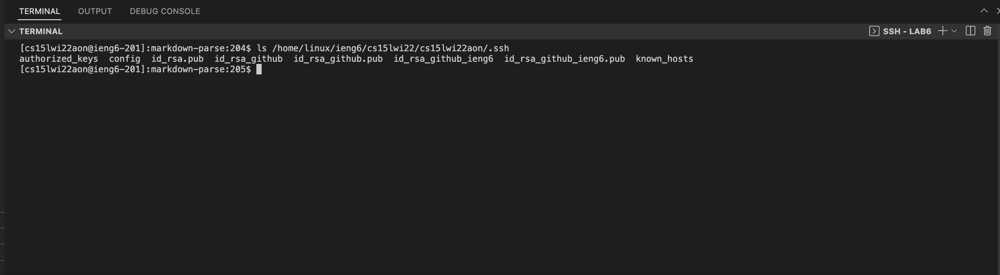
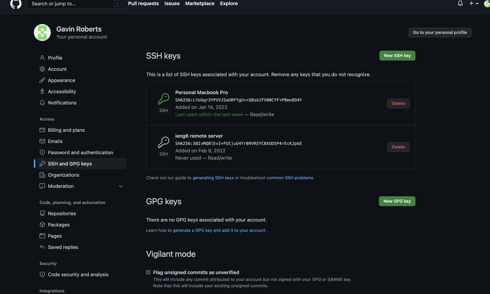
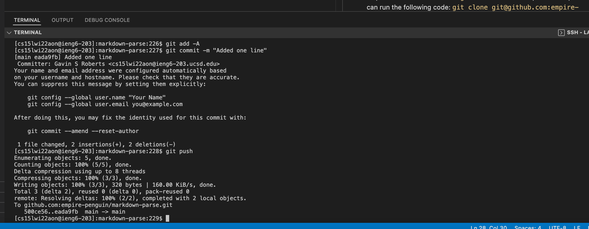

[Main Page](https://empire-penguin.github.io/empire-penguin/)

***

Lab Report 3
============

Setup Github Access From ieng6.
------------------------------------

Part 1 Generating the Secure Shell Keys
---------------------------------------
When trying to push to a github repository while logged into a remote connection 
Github will prompt the user for their username and password, yet no matter what
the user enters Github will always produce the following error:

```
remote: Support for password authentication was removed on August 13, 2021. Please use a personal access token instead.
remote: Please see https://github.blog/2020-12-15-token-authentication-requirements-for-git-operations/ for more information.
fatal: Authentication failed for 'https://github.com/empire-penguin/markdown-parse/'
```

To remedy this we need to create ssh private and public keys and upload our public key to github. To do this simply run the following command `ssh-keygen` and change the name of the generated files to be representative of what the keys will be used for. If you decided to call it `id_rsa_github_ieng6` you will be met with the following:




Part 2 Using Git SSH Commands
--------------------------

Now that we have our public and private keys generated as pictured here:


We need to send them to Github. This is as easy as opening up the public key in a text editor copying the contents to your clipboard and then pasting it in your user settings on github found under setting -> ssh keys
Here is a screen shot of that:



Part 3 Running git commit and git push
--------------------------

To prove that we now can use `git` commands that require admin permission we can run the following code: 

```
git add -A
git commit -m "Added single line"
git push
```

Here is a screen shot of that:


And here is a link to that [commit](https://github.com/empire-penguin/markdown-parse/commit/eada9fb442ae1723506af634223410b4ffe8b0fe):

