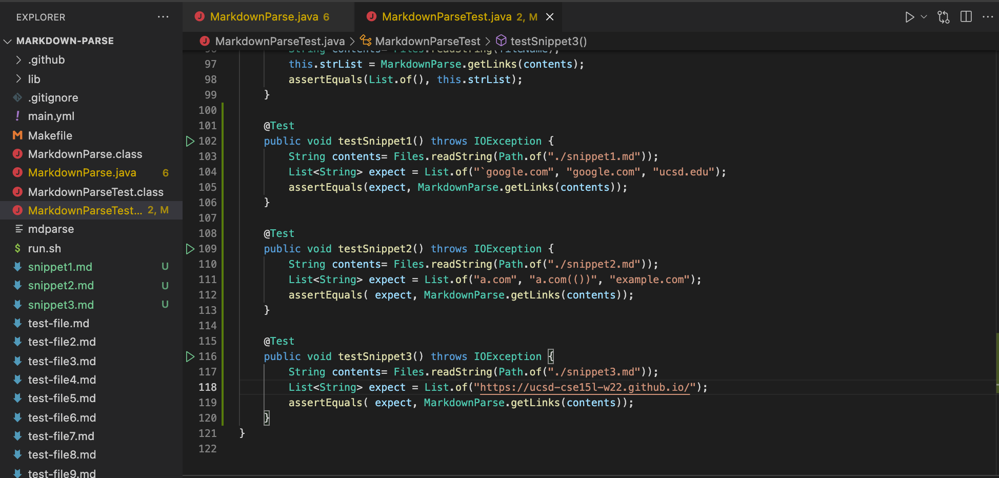
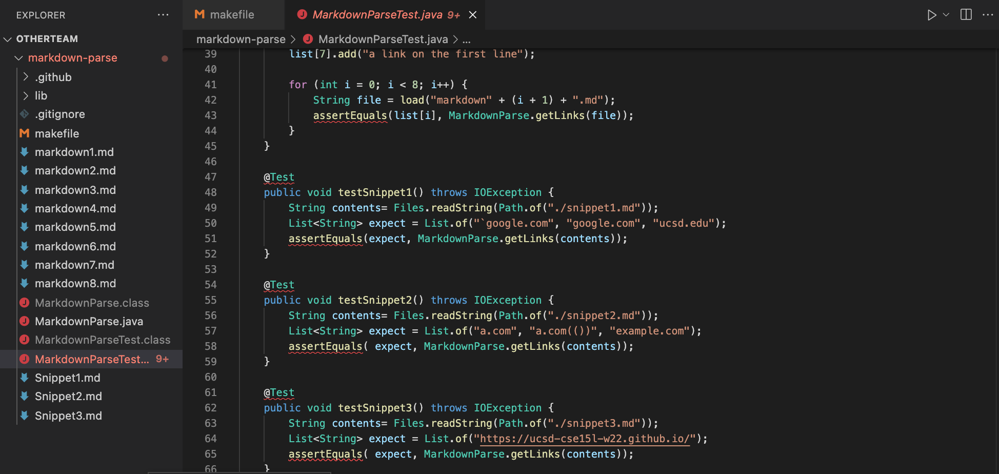
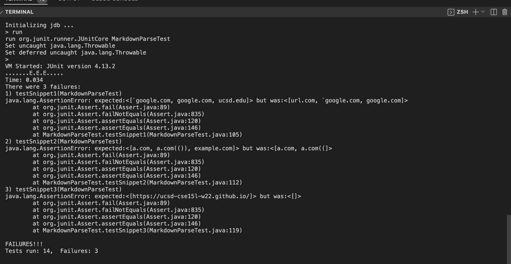
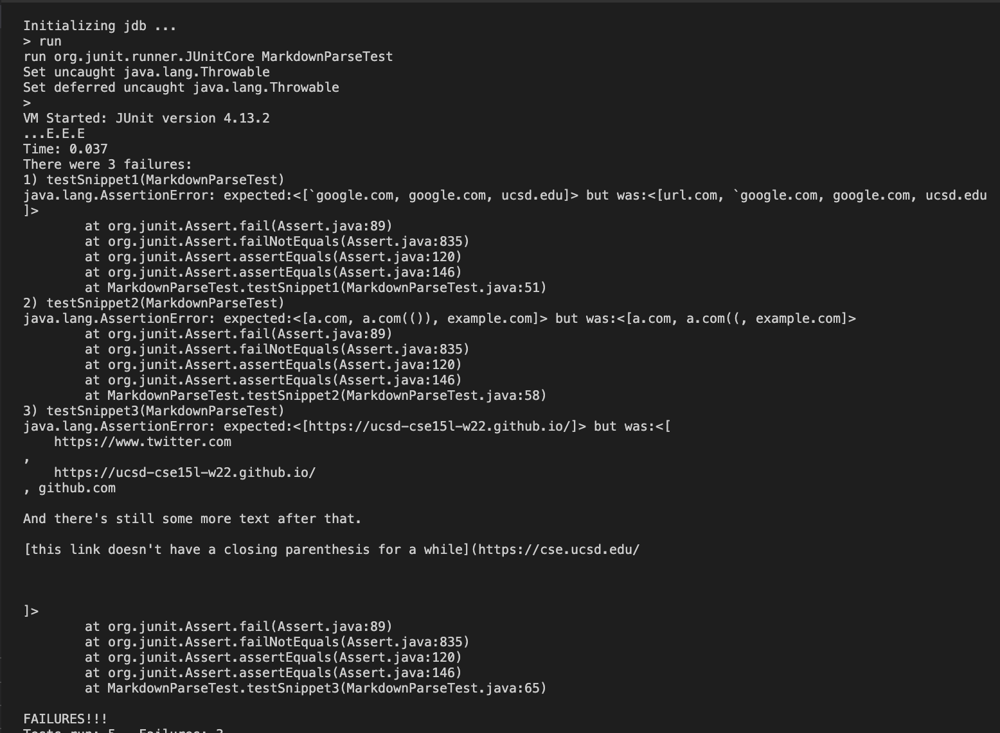

[Main Page](https://empire-penguin.github.io/empire-penguin/)

***

Lab Report 4
============

Debuggers.
------------------------------------

The purpose of this lab was to get used to using debuggers, specifically jdb, 
and how to use jdb's commands.

We used two implimentations of markdown-parse one being another team and the other being my own teams implimentation. 

The source code for the other teams implementation can be found [here](https://github.com/RyanRongY/markdown-parse) 

While my teams implementation [here](https://github.com/empire-penguin/markdown-parse)


The first code snippet
---------------------------------------
The following snippet is used as input:
```
`[a link`](url.com)

[another link](`google.com)`

[`cod[e`](google.com)

[`code]`](ucsd.edu)
```

With the expected output generated from [the CommonMark demo site](https://spec.commonmark.org/dingus/) being:
```
[a link](url.com)

another link`

cod[e

code]
```
Which means the expected array to be generated should be the following:

```["`google.com", "google.com", "ucsd.edu"]```


The second code snippet
---------------------------------------
The following snippet is used as input:
```
[a [nested link](a.com)](b.com)

[a nested parenthesized url](a.com(()))

[some escaped \[ brackets \]](example.com)
```

With the expected output generated from [the CommonMark demo site](https://spec.commonmark.org/dingus/) being:
```
[a nested link](b.com)

a nested parenthesized url

some escaped [ brackets ]
```

Which means the expected array to be generated should be the following:

```["a.com", "a.com(())", "example.com"]```


The third code snippet
---------------------------------------
The following snippet is used as input:
```
[this title text is really long and takes up more than 
one line

and has some line breaks](
    https://www.twitter.com
)

[this title text is really long and takes up more than 
one line](
    https://ucsd-cse15l-w22.github.io/
)


[this link doesn't have a closing parenthesis](github.com

And there's still some more text after that.

[this link doesn't have a closing parenthesis for a while](https://cse.ucsd.edu/


)

And then there's more text
```

With the expected output generated from [the CommonMark demo site](https://spec.commonmark.org/dingus/) being:
```
[this title text is really long and takes up more than one line

and has some line breaks]( https://www.twitter.com )

this title text is really long and takes up more than one line

[this link doesn't have a closing parenthesis](github.com

And there's still some more text after that.

[this link doesn't have a closing parenthesis for a while](https://cse.ucsd.edu/

)

And then there's more text
```

Which means the expected array to be generated should be the following:

```["https://ucsd-cse15l-w22.github.io/"]```

# Results

We implimented all the snippet test by adding the following test cases to 
both my team and the other teams `MarkdownParseTest.java` file as shown: 




After running the following tests on our implementation we recieved this output:



After running the following tests on the other teams implementation we recieved this output:



# Fixes

First Snippet
--------------
This error should be easily fixed by making sure that the character directly before 
the first bracket isn't a backtick. This will take care of returning `url.com` when it shouldn't. To fix `ucsd.edu` this is not being returned because we are breaking out of the loop too soon and we should do a parity check on brackets.

Second Snippet
--------------
This error is similar to the first one as we are breaking out of the loop too soon. 
To fix it we need to do another parity check to make sure there is a proper number of 
open and close parenthesis which can be done using a stack

Third Snippet
--------------
The final error is kind of related to the first two but is breaking out of the loop
for the wrong reason. As currently we are checking to make sure there is no whitespace between the brackets however it is allowed.

